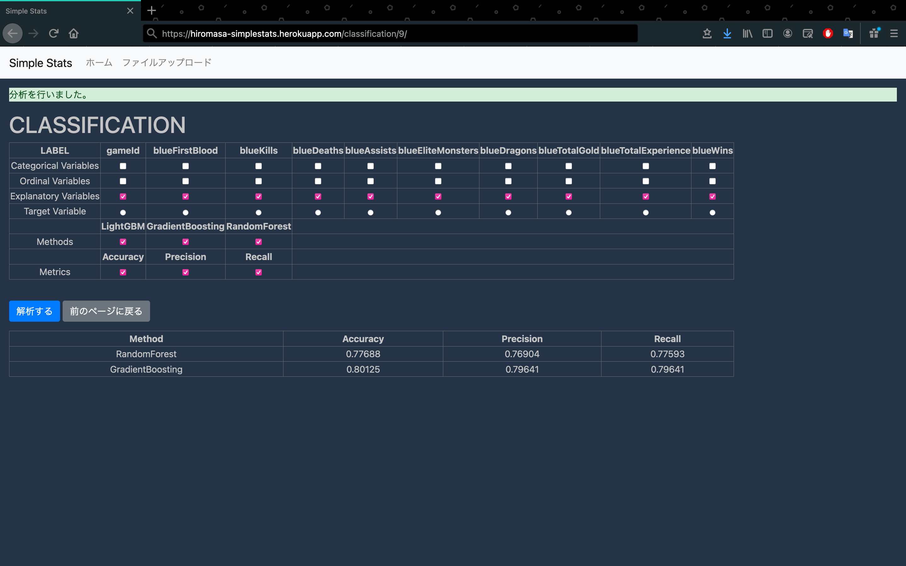

# SimpleStats

前処理済みの CSV ファイルをアップロードし、ボタンをいくつか押すだけで簡単に分析ができるウェブアプリ。まだ作成途中。

heroku デモ：https://hiromasa-simplestats.herokuapp.com/

## 注意

このレポジトリは、Django のコードを公開するために作ったレポジトリです。セキュリティ上 API Key などは隠す必要があるので、一部のファイルは敢えてレポジトリから外しています。本レポジトリを git clone してもローカルでそのまま動かすことはできないので注意してください。

## ページ説明

### トップページ

本ページからまず前処理済み(=欠測値がない、onehotencode 済み)の CSV ファイルをアップロードしてください。今のところ回帰分析と二値分類ができます。また念の為サンプルファイルを置きました。

### トップページ（CSV アップロード後）

ファイルをアップロードするとトップページに戻ります。ここでアップロードした CSV ファイルのプレビューが表示されます。「_ファイル名_ の詳細」をクリックしてシングルページへ進みます。

### シングルページ

シングルページにはデータの概要や相関行列などが表示されています。一番下にスクロールすると「2 値分類」・「回帰分析」の 2 つのオプションが表示されます。今回の例では「2 値分類」を選択します。

### 2 値分類ページ

横軸に変数、縦軸に選択項目の種類が表示されます。ここでカテゴリー変数、説明変数、被説明変数等に加え、解析手法、表示する評価基準を選択します。（※heroku の仕様上、一部モデルは重すぎて接続がタイムアウトしてしまうため使えません）

### 2 値分類ページ（解析後）

解析後は下に結果が表示され、モデルの比較が可能となります。
